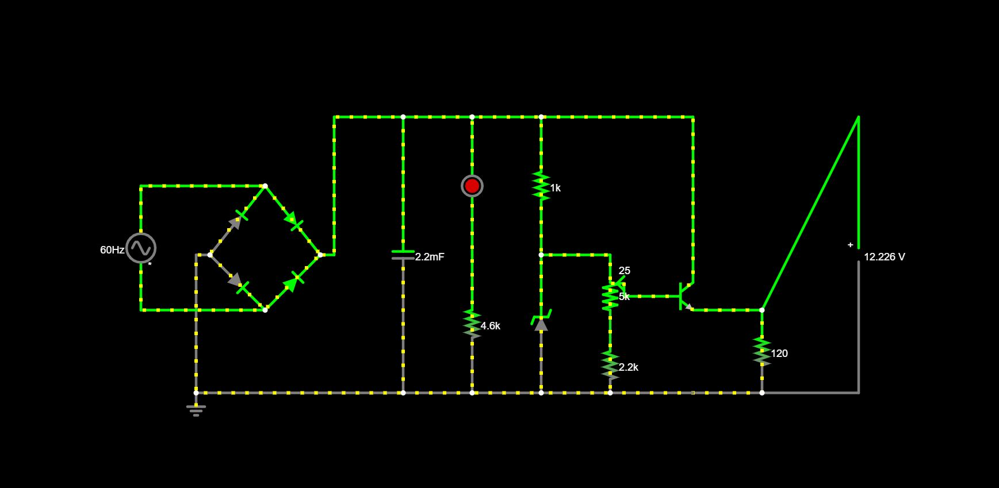
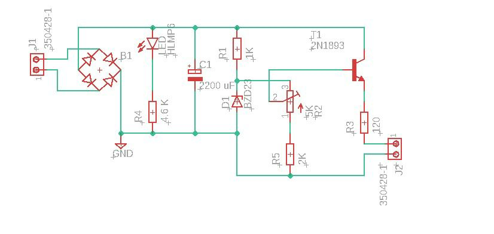
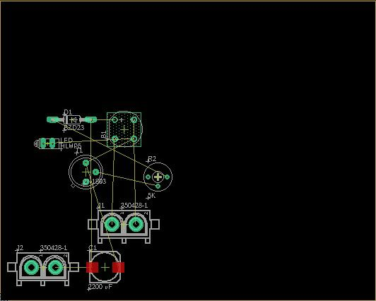
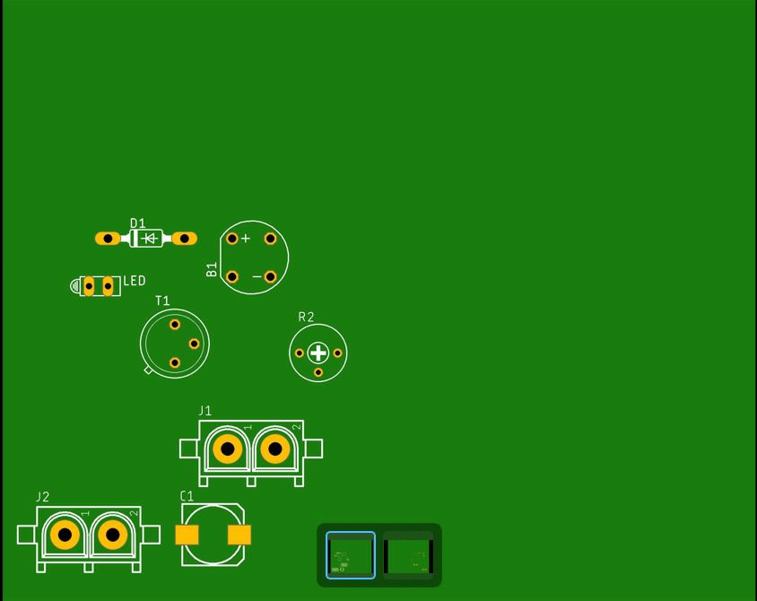

# Projeto-de-Eletronica-USP
## Participantes:
| **Nome Completo**              | **N°USP**|
|--------------------------------|----------|
| [Guilherme Motta Tranche](https://github.com/Tranche-001)               | 13671549 |
| [Allan Garcia Cavalcante e Silva]()         | 13731222 | 
| [Téo Sobrino Alves]()| 12557192 |

## Objetivo:
Desenvolver uma fonte de tensão retificadora que transforma uma corrente alternada de tensão 127RMS em uma corrente contínua.
A fonte deve ser capaz de variar sua tensão entre 3 e 12 volts.

## Falstad:

## Equações:

## Imagem esquemático da PCB no Eagle

## Escolha dos componentes:
| Quantidade | Componentes        | Valor R$ |
|------------|--------------------|----------|
| 4x         | Diodo retificador  | [R$ 0,15  x  4 = R$0,60]|
| 1          | Led Vermelho 5mm   | [R$ 0,50]|
| 1          | Resistor 1K ohm    | [R$ 0,07]|
| 1          | Resistor 2.2k      | [R$ 0,07]|
| 1          | Resistor 4.6k      | [R$ 0,07]|
| 1          | Potenciômetro  5k  | [R$ 7,00]|
| 1          | Diodo Zener (13v)  | [R$ 0,48]|
| 1          | Transistor NPN     | [R$ 0,50]|
| 1          | Fusível            | [R$ 1,10]|
| 1          | Capacitor          | [R$ 1,40]|
| **Total**  |                    |  R$ 11,72|

## Link dos videos
[Explicação](https://youtu.be/LUXpvP4fZ_o)

[Fonte Funcionando](https://youtu.be/2NTbzgn1dZc)

