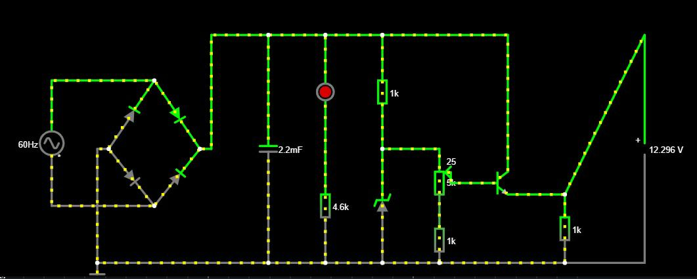

# Projeto-de-Eletronica-USP
## Participantes:
| **Nome Completo**              | **N°USP**|
|--------------------------------|----------|
| [Guilherme Motta Tranche](https://github.com/Tranche-001)               | 13671549 |
| [Allan Garcia Cavalcante e Silva](https://github.com/rinderomna)         | 13731222 | 
| [Raphael David Phillippe Levéque](https://github.com/raphaelleveque)| 12542522 |

## Objetivo:
Desenvolver uma fonte de tensão retificadora que transforma uma corrente alternada de tensão 127RMS em uma corrente contínua.
A fonte deve ser capaz de variar sua tensão entre 3 e 12 volts.

## Falstad:

## Equações:

## Imagem esquemático da PCB no Eagle

